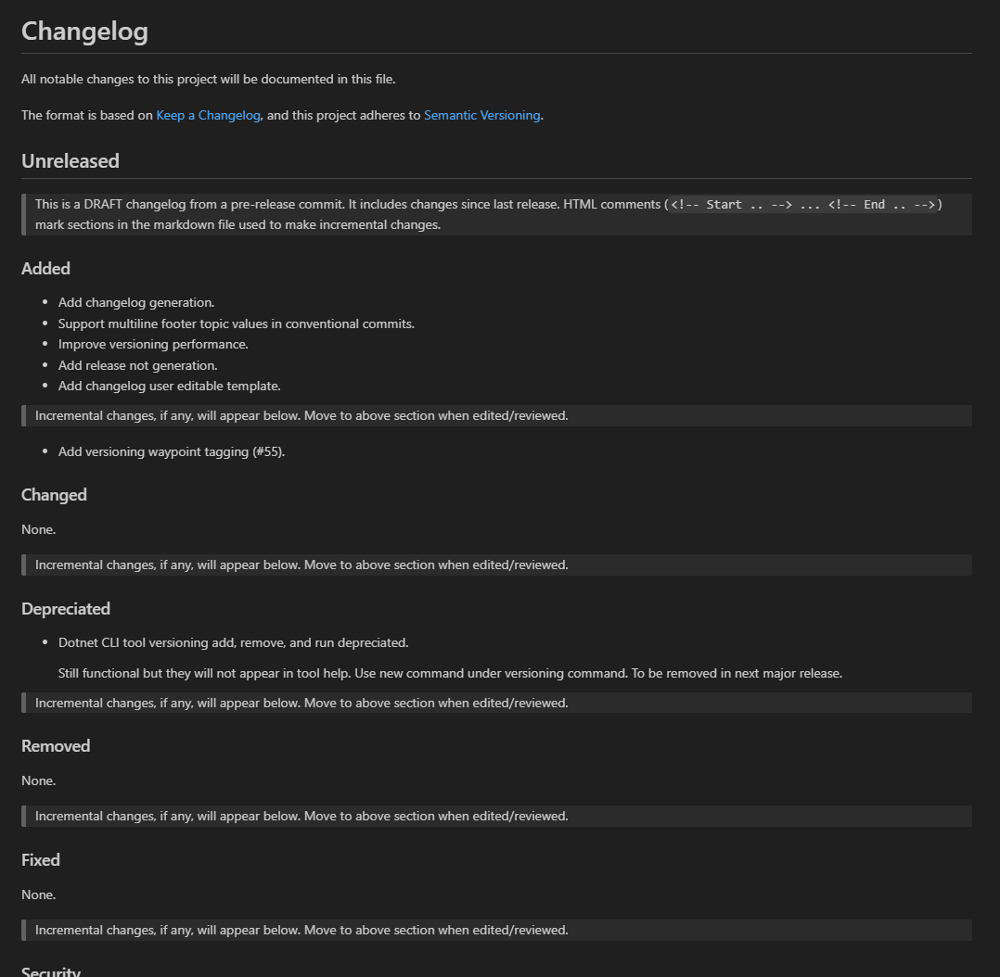

# Git2SemVer changelog generation

**Git2SemVer** leverages [conventional commits](https://www.conventionalcommits.org/en/v1.0.0/) used to version .NET solutions and projects to
also generate a changelog for the upcoming release.

> [!NOTE]
> Currently only the **Git2SemVer.Tool** can generate a changelog.
> It is planned to add this functionality to **Git2SemVer.MSBuild** later 2025 so that the changelog is automatically updated on every build.

An example generated draft (pre-release) changelog fragment:

