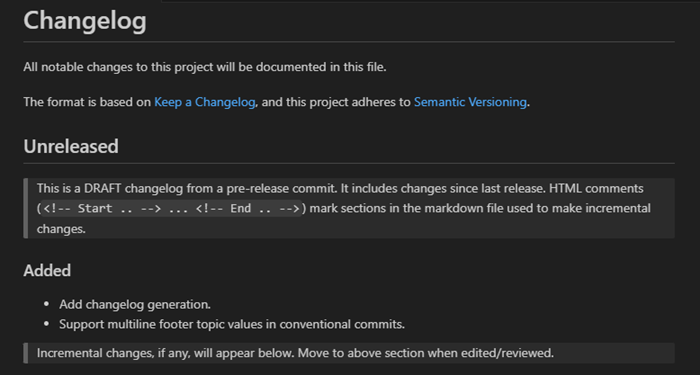
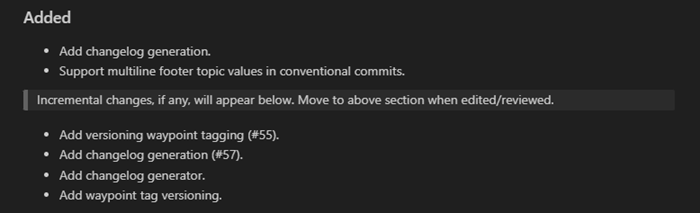
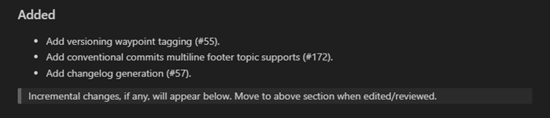
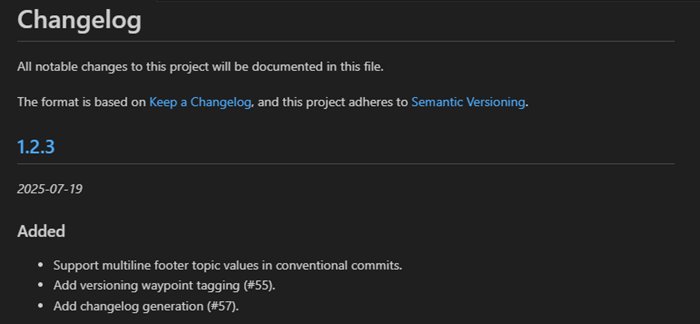
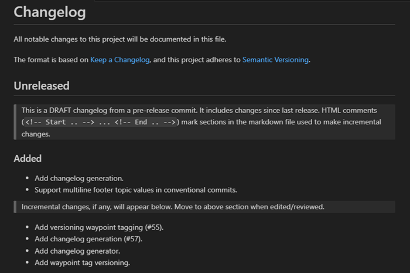
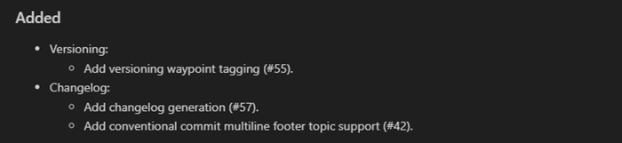

---
uid: changelog-workflow
---

# Changelog - Workflow

## Summary

A generated changelog is kept in the Git repository and may be manually groomed at any time
during the release development cycle.

The standard workflow is:

| #       | Description                       | Changelog fragment    |
|  :--:   | :--                               | :-- |
| &#9312; | New changelog generated           |  |
| &#9313; | **Git2SemVer** discovers changes  |  |
| &#9314; | You groom (optional)              |  |
| &#9315; | Repeat steps &#9313; & &#9314;    |   |
| &#9316; | A release changelog is generated  |  |
| &#9317; | A build is released               |   |
| &#9318; | After release                     | A new changes list is automatically added to the changelog. Goto &#9313.  |

The following sections give more details.

## Changelog generation

> [!NOTE]
> The [Scriban template file](xref:changelog-templating) determines the changlog layout and content.
> The documentation here assumes the default template is used.

### Release build

A changelog generated on a release build:

* Shows the build version.
* Adds a link to the release artifact (see [artifact url option](xref:git2semver-tool-commands)).

A release changelog fragement will look something like:


### Prerelease build

A changelog generated on a pre-release build:

* Has an `Unreleased` header.

A pre-release changelog fragment will look something like:



## New release detected

When **Git2SemVer** detects that there has been a new release since the last time the changelog was generated,
it add a new changes section  for the next release at the top of the changelog. 
The prior release's changes remain in the changelog but the last run data is reset.

## New change detected

New changes are appended to the end existing changes list.

## Grooming

The generated changelog is kept in the Git repository and may be groomed at any time
during the release development cycle.

## Pull requests

When change is ready for merging into a release branch:

1. Make the required [Conventional Commits](https://www.conventionalcommits.org/en/v1.0.0/) commit.
2. Regenerate the changelog, groom, and commit.
3. Raise pull request.

This makes the changelog part of the pull request so that reviewers:

* Can see that a correct [Conventional Commits](https://www.conventionalcommits.org/en/v1.0.0/) has been made.
This ensures correct versioning.
* Can review changelog entry and change type used.

## Q&A

### Will duplicate Conventional Commits make changes reappear in the changelog?

No. **Git2SemVer** keeps of record of [Conventional Commits](https://www.conventionalcommits.org/en/v1.0.0/) that have been handled
and will not add them to the changelog a second time.

However, if a commit with a duplicate summary different issues in the commit footer, it is a new change.

For example the following commits will be seend as different changes:

```console
Commit 1:
  feat: add fruit edit page

  issue: #44

Commit 2:

  feat: add fruit edit page

  issue: #44,#61
```

These will changelog changes like:

```console
  Add fruit edit page (#44)
  Add fruit edit page (#44,#61)
```

> [!TIP]
> Groom - Deleting the first change in the changelog if the second change is better.

### Can I delete a change from the changelog?

Yes. **Git2SemVer** will only add a change once for each release.

## Can I organise changes into subgroups?

Yes. The content and layout of the groomed issues list is up to you.
**Git2SemVer** will not alter changes content already present in the changelog.

For example, you could organise issues like:



## Change header or layout when grooming

Yes. However consider editing the [template file](xref:changelog-templating) to preserve these changes when/if a new changelog is generated.
