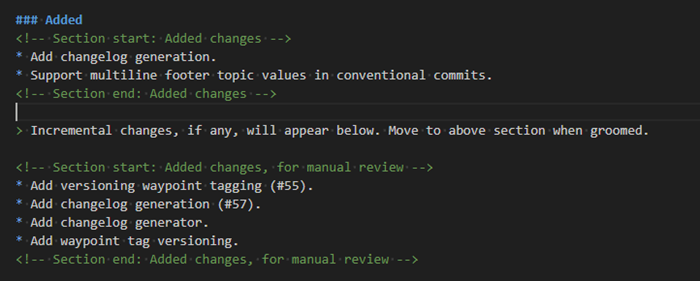
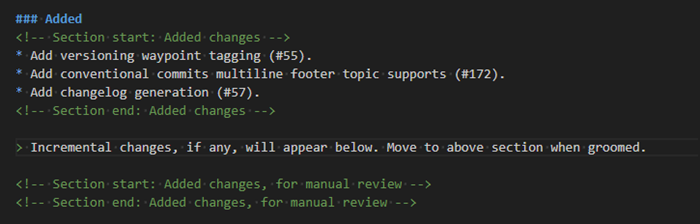

---
uid: changelog-workflow-incremental
---

# Changelog - Incremental Workflow

## Summary

An generated incremental changelog is kept in the Git repository and may be manually groomed at any time
during the release development cycle.

The workflow could be summarised as:

| #       | Description                       | Changelog fragment    |
|  :--:   | :--                               | :-- |
| &#9312; | New changelog generated           |  |
| &#9313; | **Git2SemVer** discovers changes  |  |
| &#9314; | You groom                         |  |
| &#9315; | Repeat steps &#9313; & &#9314;   ||
| &#9316; | A release is built                |  |

The following sections give more details.

## Changelog generation

> [!NOTE]
> The [Scriban template file](xref:changelog-templating) determines the changlog layout and content.
> The documentation here assumes the default template is used.

### Release build

A incremental changelog generated on a release build:

* Shows the build version.
* Adds a link to the release artifact (see [artifact url option](xref:git2semver-tool-commands)).
* Hides all hint text that appears in pre-release changelogs.
* Lists all incremental changes after reviewed changes (one group).

A release changelog fragement will look something like:

### Prerelease build

An incremental changelog generated on a pre-release build:

* Has an `Unreleased` header.
* Includes hint text.
* Keeps add incremental changes slightly separated from reviewed changes.

A pre-release changelog fragment will look something like:

## New release detected

When **Git2SemVer** detects that there has been a new release since the last changelog generation run,
it starts a new changelog for the next release. The prior release's changelog and data are discarded.
If no changes have been made since the last release, the new changelog will be empty.

An incremental changelog is a draft changelog of changes from the prior releasee up to the head commit.

To maintain changelog accross multiple releases the options are:

* On the release's commit use the changelog command `new-release` and commit the change. 
This will create a new `Unreleased` section and move changes to just below the `Unreleased` section.

## New change detected

On a release build, new changes are appended to the existing changes list.

On a pre-release build, new change are appended to a list of incremental changes that is kept below
the manually reviewed changes list.

A pre-release changelog fragment example showing 2 reviewed changes and 4 incremental changes:

## Grooming

An generated incremental changelog is kept in the Git repository and may be edited (groomed) at any time
during the release development cycle.

As changes are added the incremental changes lists in each category (like `Added`) will grow.
Being in the repository these changes have visibility in commits and pull request reviews.
This promotes early grooming.

Sections in the markdown file are marked by HTML commits like:

When grooming a change move it out of the incremental section and into the changes list above.
For example the above changelog may be groomed to:

Or, viewed, changelog:

## Q&A

### Will duplicate Conventional Commits make changes reappear in the changelog?

No. **Git2SemVer** keeps of record of [Conventional Commits](https://www.conventionalcommits.org/en/v1.0.0/) that have been handled
and will not add them to the changelog a second time.

However, If a commit with a duplicate summary but new/different footer related issue
values is found, it is a new change.

### Can I delete a change from the changelog?

Yes. **Git2SemVer** will only add a change once for each release.

## Can I organise changes into subgroups?

Yes. The content and layout of the groomed issues list is up to you.
**Git2SemVer** will not alter changes content already present in the changelog.

For example, you could organise issues like:

## Change header or layout when grooming

Yes. However consider editing the [template file](xref:changelog-templating) to preserve these changes when/if a new changelog is generated.
