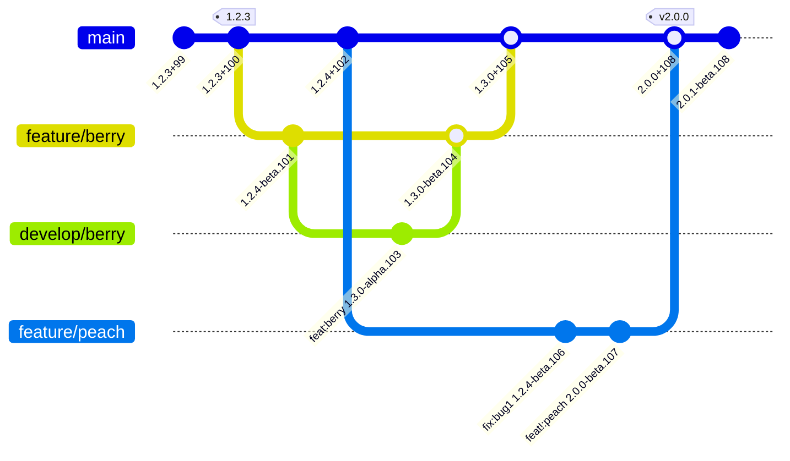

# Git2SemVer

**Git2SemVer** is a Visual Studio and developer friendly <a href="https://semver.org">Semantic Versioning</a> and changelog generation framework for .NET solutions or projects using dotnet CLI or Visual Studio.
Every build, on both developer boxes and the build system, without scripts or environment tools. Just add the NuGet package.

    

        

            

                

                    
<a href="/articles/Versioning/Versioning.Landing.html">Automatic Versioning</a>

                    
Tutorials to add automatic Semantic versioning, from <a href="https://www.conventionalcommits.org/en/v1.0.0/">Conventional Commits</a>, to your projects or solution.

                

            

        

        

            

                

                    
<a href="/articles/ChangelogGen/ChangelogGenerationLanding.html">Changelog Generation</a>

                    
Tutorials to add incremental draft changelog generation from <a href="https://www.conventionalcommits.org/en/v1.0.0/">Conventional Commits</a>.

                

            

        

        

            

                

                    
<a href="/articles/Git2SemVer.MSBuild/Git2SemVer.MSBuild.Landing.html">Git2SemVer.MSBuild</a>

                    

                    
A nuget package that adds a versioning task for every build.

                

            

        

        

            

                

                    
<a href="/articles/Git2SemVer.Tool/Git2SemVer.Tool.Landing.html">Git2SemVer.Tool</a>

                    

                    
A dotnet tool nuget package providing command line versioning and changelog generation.

                

            

        

    

**Git2SemVer** leverages [conventional commits](https://www.conventionalcommits.org/en/v1.0.0/) to silently version .NET solutions and projects.
The MSBuild Nuget packages adds **Git2SemVer** versioning to every build while the dotnet tool provides stand-alone use and changelog generation.

 

An example git workflow from a release `1.2.3` to the next release `2.0.0`:

 

An example generated draft (pre-release) changelog fragment:

